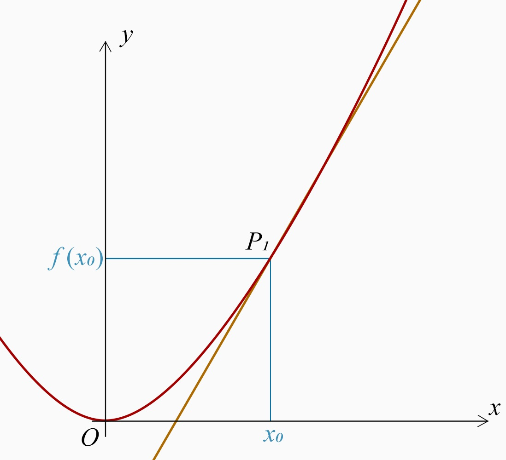
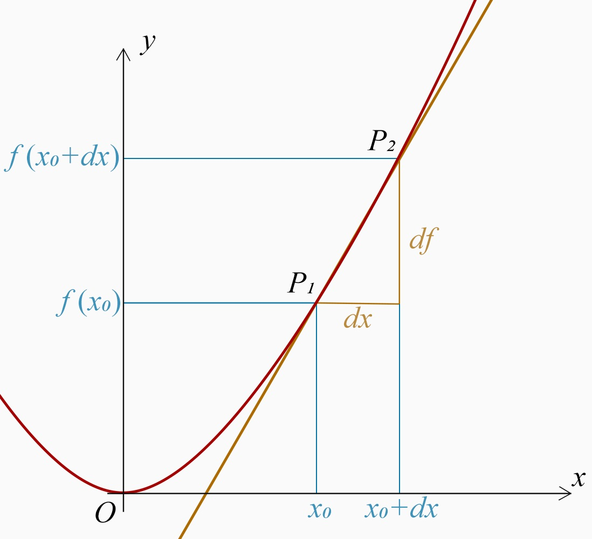

# 微积分入门 | Introduction of Calculus

<a href=".." style="font-size:22px;">回到 LazyCat</a>

### 引入：匀加速直线运动

假设有一辆汽车，原先是静止的。现在它启动，并以每 $1\text{m/s}^2$ 的加速度加速，$60\text{s}$ 后，它驶过的路程是多少？

问题中汽车不做匀速直线运动，而是做匀加速直线运动，即它的加速过程中加速度保持不变。如果你学过匀加速直线运动，你或许知道在匀加速直线运动中求物体移动的路程的公式：$s=\cfrac{1}{2}at^2$。因此，它驶过的路程 $s_2=\cfrac{1}{2}\times1\text{m/s}^2\times(60s)^2=1800\text{m}$。

你或许会疑惑，“$s=\cfrac{1}{2}at^2$”这个公式是怎么来的？为什么要乘以 $\cfrac{1}{2}$？平方项又从何而来？实际上，这是一个值得探讨的问题，并且是积分学所研究的一个简单的问题。

让我在这里演示一下它简要的推导过程。

设加速度为 $a$ ，则记任意时刻 $t$ 时的速度
$$
v(t)=at.
$$
所以任意时刻 $t$ 移动的路程
$$
s(t)=\int vdt=\frac{1}{2}at^2.
$$

其中的 $\int$ 是积分符号。欲知详情，请学习微积分（硬核引入）。

## 一、微分

微分与积分互为逆运算，并且你应当先学习微分。理解了微分，才好用逆运算的思想来学习积分。

### 切线、斜率与导数

先来看函数 $f(x)=x^2$ 的图象：

图中的抛物线（开口向上）即函数 $f(x)=x^2$ 的图象，而直线是函数 $f$ 在 $x_0$ 处的**切线**，或者说是**过点 $P_1$ 的切线**。*这里可以理解为：切线是一条与函数的某一点最吻合的直线。*如果切线是水平的，则说明这一点是函数的一个拐点。在这个例子中，函数 $f$ 有且仅有一个拐点，它在 $x=0$ 处。

假如该切线的方程为 $y=kx+b$ ，则 $k$ 叫做它的**斜率**。若 $k>0$，则切线向上；若 $k<0$，则切线向下。*这里可以理解为：斜率就是瞬时增长率。*

更准确地说，$k$ 是函数 $f(x)$ 在 $x=x_0$ 处的斜率。在高中，我们将它记作 $f'(x_0)$。函数 $f'$ 就叫做 $f$ 的导函数，简称**导数**。导数用于求函数在某点的斜率。

### 求导与极限

我们已经弄懂了什么导数，那么我们如何求它呢？

让我们从切线入手，试着求出它的斜率的表达式，即函数的导数。但是，我们知道，两点才能确定一条直线，而我们要求的是”某点”的切线（或许你已经发现这一点了），我们该如何处理呢？让我们再来看看下面这幅图：

 

在图中，我们在函数 $f$ 上取了两个点，它们分别是：$P_1(x_0,f(x_0))$ 、$P_2(x_0+dx,f(x_0+dx))$。从 $P_1$ 到 $P_2$，横坐标 $x$ 增长了 $dx$（至于什么要起这个名字，我们后面再讲），纵坐标 $y$ 增长了 $f(x_0+dx)-f(x_0)$（我们不妨把它记作 $df$）。则，过这两点的直线的斜率为 $\cfrac{df}{dx}$。*这里可以理解为：$x$ 增长了 $dx$，$f$ 跟着增长了 $df$，增长率就是 $\cfrac{df}{dx}$。*

前文说到，导数用于求函数在某点的斜率，可以记作 $f'$。到了这里，我们便能得到
$$
f'=\frac{df}{dx}=\frac{d}{dx}f.
$$

在采用最后一种书写方式时，为了避免歧义，若函数 $f$ 包含多项，需加上一层括号。

***

到这里，为我们还是在求过两点的切线的斜率。但是，如果让 $P_2$ 不断靠近 $P_1$，这一条切线会不断趋近于我们梦寐以求的过 $P_1$ 的切线。

我们将这条切线的斜率的表达式展开：
$$
\frac{df}{dx}=\frac{f(x_0+dx)-f(x_0)}{dx}.
$$
在这个例子中，我们代入 $f(x)=x^2$，得
$$
\frac{df}{dx}=\frac{f(x_0+dx)-f(x_0)}{dx}=\frac{(x_0+dx)^2-x_0^2}{dx}.
$$
化简，得
$$
\frac{df}{dx}=2x_0+dx.
$$
上文说道，如果让 $P_2$ 不断靠近 $P_1$，这一条切线会不断趋近于过 $P_1$ 的切线。**所以，当 $dx$ 越来越趋近于 $0$ 时，所得的切线会越来越趋近过 $P_1$ 的切线。**观察发现，当 $dx$ 趋近于 $0$，时，表达式的值会越来越趋近于 $2x$。

所以，函数 $f$ 的导数为
$$
\frac{df}{dx}=2x.
$$
式中的 $x_0$ 表示，当 $x=x_0$ 时，此处的斜率为 $2x_0$。

***

我们在 $x$、$f$ 前加的前缀“$d$”，表示这个量是非常非常微小的。这样一来，求得的切线与实际切线的误差也会越来越小。这种思想（即上文加粗的片段）叫做**极限**（Limit，数学上记作 $\lim$）。

用极限的形式来写我们求函数 $df$ 的导数的过程，即
$$
\frac{df}{dx}=\lim_{\Delta x\to0}\frac{f(x_0+\Delta x)-f(x_0)}{\Delta x}.
$$
式中，$\lim_{\Delta x\to0}$ 意思是整个式子表示的是 $\frac{f(x_0+\Delta x)-f(x_0)}{\Delta x}$ 中 $\Delta x$ 趋近于 $0$ 时的值。

式中，我们令 $\Delta x$ 趋于 $0$，使它越来越微小。这种思想，也叫做**微分**。在微分学中，$d$ 是一个特殊的符号，表示一个微小的量。在适当的时候，我们将其当作 $0$ 处理。*这里可以理解为：$d(...)$ 就是一个 $\Delta(...)$，并且还随身带着一个 $\lim_{\Delta(...) \to0}$。*

为了避免歧义，若 $(...)$ 包含多项，需加上一层括号，如：$d(x^2)$。

### 关于极限的“矛盾”

在极限思想，尤其是微分思想中，有一点需要尤其注意：$dx\neq0$。因而，它可以作分母，并且是有意义的（因为它趋近于零 $0$，但始终不等于 $0$，始终有一个 $\neq0$ 的值）。但是，我们能在计算的最后将它视为 $0$ 来处理，因为它是一个非常小的值。

这个矛盾比较令人困惑，为什么这个 $dx$ 一会儿不是 $0$，一会儿又是 $0$？让我们回到 $\cfrac{df}{dx}=\cfrac{(x_0+dx)^2-x_0^2}{dx}$ 的时候。在 $x=2$ 处，有
$$
\frac{df}{dx}=\frac{(2+dx)^2-4}{dx}.
$$
按照上文推导出来的结果，$\cfrac{df}{dx}=2x=2\times 2=4 $。

下表列出了当 $dx$ 取不同值的时候，$\cfrac{df}{dx}$ 的值是多少：

| $dx$  | $\cfrac{df}{dx}$ |
| ----- | ---------------- |
| 1     | 5                |
| 0.1   | 4.1              |
| 0.01  | 4.01             |
| 0.001 | 4.001            |

可见，结果确实如之前为我们推导出来的，当 $dx$ 趋近于 $0$ 时，$\cfrac{df}{dx}$ 趋近于 $4$。这也印证了我们那样处理 $dx$ 是可行的。

### 求导公式与法则

下面列出了 7 个基本初等函数的导数公式（$a$ 为常数）：
$$
\frac{d}{dx}a=0.\tag{1}
$$
$$
\frac{d}{dx}(ax)=a.\tag{2}
$$
$$
\frac{d}{dx}x^a=ax^{a-1}.
$$
$$
\frac{d}{dx}\sin x=\cos x.\tag{4}
$$
$$
\frac{d}{dx}\cos x=-\sin x.\tag{5}
$$
$$
\frac{d}{dx}a^x=a^x\ln a.\tag{6}
$$
$$
\frac{d}{dx}\log_{a}x=\frac{1}{x\ln a}.\tag{7}
$$

下面是求导的**加法法则**：
$$
\frac{d}{dx}(f(x)\pm g(x))=\frac{df}{dx}\pm \frac{dg}{dx}.\tag{8}
$$
下面是求导的**乘积法则**（口诀：右乘左导，左乘右导）：
$$
\frac{d}{dx}(f(x)g(x))=g(x)\frac{df}{dx}+f(x)\frac{dg}{dx}.\tag{9}
$$
下面是求导的**链式法则**：
$$
\frac{d}{dx}f(g(x))=\frac{df}{dg}\frac{dg}{dx}.\tag{10}
$$