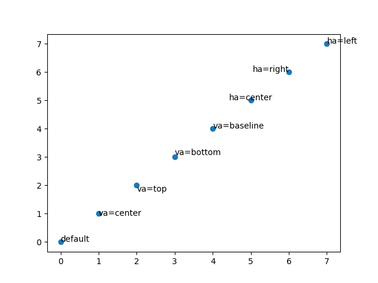
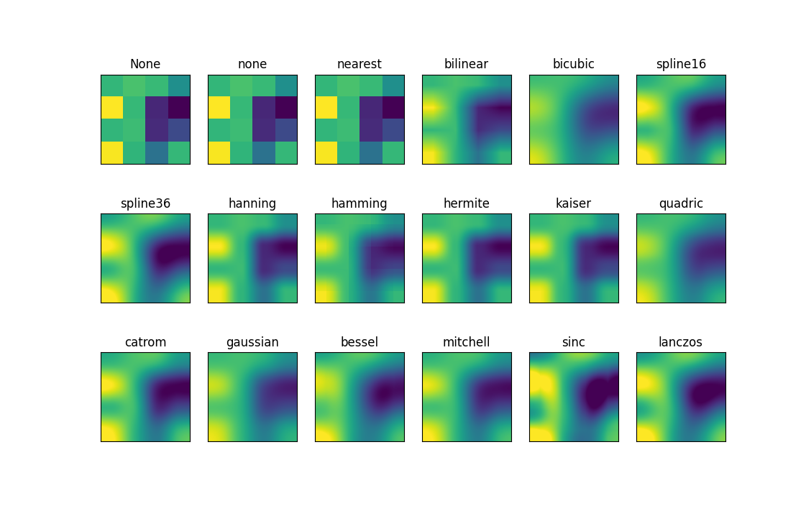

# Matplotlib 入门

<a href=".." style="font-size:22px;">回到 LazyCat</a>

### Matplotlib 简介


Matplot 是一个 Python 库，用来可视化 2D 数据甚至 3D 数据。它可以绘制各种图形，并且提供一个 GUI，是非常强大也常用的库。

本文参考[【莫烦Python】Matplotlib Python 画图教程](https://www.bilibili.com/video/BV1Jx411L7LU)编写。

本文介绍如何安装 Matplotlib 以及用 **Python** 编写 Matplotlib 程序（搭配 **Numpy**）。

## 一、Matplotlib 的安装

使用 pip 安装 Matplotlib（用中国科学技术大学镜像源），详见《C++到Python》。在 cmd 或 PowerShell 中输入下面的指令：

```
pip install -i https://pypi.mirrors.ustc.edu.cn/simple matplotlib
```

## 二、折线（plot）

在下文中，程序的开头默认已经加上了：

```python
import matplotlib.pyplot as plt
import numpy as np
```

以下是一个 Matplotlib 程序的简单例子：

```python
#创建要绘制的数据
x = np.linspace(-5,5,100)
y = x ** 2

#绘制折线图
plt.plot(x,y)

#显示窗口
plt.show()
```

运行结果：


程序新建了一个窗口，并在那个窗口上绘制了折线图。窗口的底部还有一些按钮，可以调整图像以及保存图像，非常方便。之后的例子放上来的图像都是这样保存得来的。

事实上，`plt.plot()` 的原理是依次连接 (x[i], y[i]) 各点，并不只能绘制折线图。

### 绘制不同线形

以下例子绘制一种指定的线形（部分代码，下同）：

```python
#创建要绘制的数据
x = np.linspace(-5,5,10)
y = x ** 2

plt.plot(x,y,'o--')#最后一个参数详见后面给出的表格
```


接受以下格式字符串字符来控制线条样式

 ```
 '-'      实线
 '--'    虚线
 '-.'    点与线
 ':'     点
 ```
接受以下格式字符串字符来控制线条标记：
```
 '.'     点标记
 ','    像素标记
 'o'    圆圈标记
 'v'    倒三角标记
 '^'    正三角标记
 '<'    左三角标记
 '>'    右三角标记
 '1'     向下Y标记
 '2'    向上Y标记
 '3'    向左Y标记
 '4'    向右Y标记
 's'    正方形标记
 'p'    五角星标记
 '*'     *标记
 'h'    六边形1 标记
 'H'    六边形2 标记
 '+'    +标记
 'x'    x标记
 'D'    钻石标记
 'd'    薄砖石标记
 '|'    垂直线标记
 '_'    水平线标记
```

以上两种控制字符串可以组合使用。

 ### 绘制不同颜色、粗细、不透明度

从上图可以看出，当我们绘制不同折线的时候，Matplotlib 自动为我们更改了颜色。以下例子绘制自定义颜色、粗细、不透明度的线：

```python
#创建要绘制的数据
x = np.array([0.0,1.0])
y = np.empty([2])

y = x
plt.plot(x,y,color='red')

y = 1 - x
plt.plot(x,y,color='#14C8FF',linewidth=5.0,alpha=0.5)
#color：颜色，可以设为none，即没有颜色
#linewidth：粗细
#alpha：不透明度
```


### 折线的句柄（获取其颜色）

实际上，`plt.plot()` 函数是有返回值的，它返回一个元组，其中包含了折线的句柄，以下例子在绘制折线时保存了句柄：

```python
l, = plt.plot(x,y)#记得要拆包！
```

有了折线得句柄，我们可以进行更多操作，比如获取折线的颜色。以下例子绘制 10 条直线，并输出它们的颜色（Matplotlib 默认颜色 10 个一循环）。

```python
#创建要绘制的数据
x = np.array([0,1])
y = np.empty([2])

for i in range(10):
    y.fill(1 - i / 10)
    l, = plt.plot(x,y)
    print(l.get_color())
```

运行结果：

```
#1f77b4
#ff7f0e
#2ca02c
#d62728
#9467bd
#8c564b
#e377c2
#7f7f7f
#bcbd22
#17becf
```


## 三、绘图区及窗口基本操作

### 创建不同的窗口绘图

以下例子创建不同的窗口绘图：

```python
#创建要绘制的数据
x = np.array([0,1])
y = np.empty([2])

y = x
plt.figure()#创建一个新的窗口，此后将在新的窗口种绘图
plt.plot(x,y)

y = -x
plt.figure()#创建一个新的窗口
plt.plot(x,y)
```

运行结果：


还可以在 `plt.figure()` 中指定参数 `num`，更改创建的窗口的序号（注意窗口标题）。

### 设置坐标轴

以下例子设置坐标轴的范围、标题、刻度：

```python
#创建要绘制的数据
x = np.linspace(-6.28,6.28,100)
y = np.cos(x)

#设置x轴的范围
plt.xlim([-12.56,12.56])

#设置x轴和y轴的标题
plt.xlabel('x',loc='right')
plt.ylabel('cos(x)',loc='top')
#loc:标题的位置，详见后面给出的表格

#设置x轴刻度
plt.xticks([-6.28,-3.14,0,3.14,6.28],#刻度对应的数字
           ['$-2\pi$','$-\pi$','$0$','$\pi$','$2\pi$'])#刻度对应的文字（支持LaTeX）

#绘制
plt.plot(x,y)
```


`loc` 可以是下列各值：

```
‘best’ （自动寻找最好的位置）
‘upper right’ （右上角）
‘upper left’ （左上角）
‘lower left’ （左下角）
‘lower right’ （右下角）
‘right’ （右边中间）
‘center left’ （左边中间）
‘center right’ （右边中间）
‘lower center’ （中间最下面）
‘upper center’ （中间最上面）
‘center’ （正中心）
```

### 设置坐标轴（高级）

通过获取坐标轴的句柄，我们可以进行更高级的操作。注意观察前面的图片，发现其实图像四周都有像边框一样的坐标轴。以下是调整它们的例子：

```python
#创建要绘制的数据
x = np.linspace(-6.28,6.28,100)
y = np.cos(x)

#获取坐标轴的句柄
ax = plt.gca()

#隐藏上面和右边的坐标轴
ax.spines['top'].set_color('none')
ax.spines['right'].set_color('none')

axs[0].set_title('cos(x)')

#设置x轴和y轴刻度分别显示在下面和左边的坐标轴上（尽管默认就是）
ax.xaxis.set_ticks_position('bottom')
ax.yaxis.set_ticks_position('left')
"""
ax.xaxis.set_visible(False)#隐藏X轴
ax.yaxis.set_visible(False)#隐藏Y轴
"""

#设置下面和左边的坐标轴的位置
ax.spines['bottom'].set_position(['data',0])#在x=0处
ax.spines['left'].set_position(['data',0])#在y=0处

#绘制
plt.plot(x,y)
```

运行结果：


### 绘制网格、标题

以下是一个例子：

```python
#创建要绘制的数据
x = np.linspace(-6.28,6.28,100)
y = np.cos(x)

#显示网格
plt.grid(True)

#显示标题
plt.title('cos(x)',fontsize=18)
#fontsize:字体大小
#还可以设置的参数：
#loc
#pad:表示标题与图表顶部的距离（向上多少），默认为None

#绘制
plt.plot(x,y)
```

运行结果：


## 四、图例（legend）

以下例子设置不同折线的标签，然后调用 `plt.legend()` 绘制图例：

```python
#创建要绘制的数据
x = np.linspace(-6.28,6.28,100)

y1 = np.cos(x)
y2 = np.sin(x)

plt.plot(x,y1,label='cos(x)')
plt.plot(x,y2,label='sin(x)')

#绘制图例
plt.legend()
#还可以设置的参数：
#loc:图例的位置
```

运行结果：


## 五、散点图（scatter）

以下是一个例子：

```python
#创建要绘制的数据
x = np.random.normal(0,0.5,1000)
y = np.random.normal(0,0.5,1000)
color = np.sqrt(x ** 2 + y ** 2)

#绘制
plt.scatter(x,y,c=color,cmap='binary')
#c:用来指定每个点的颜色，可以不设置
#cmap:映射颜色的方式，可以不设置，详见后面给出的图

#还可以设置的参数：
#color，alpha
```

运行结果：


### 颜色映射（cmap）

Matplotlib 中的颜色映射一共有 75 种，（不包含后缀 `_r` 的，后缀 `_r` 就是对应的反转版本）。以下罗列了所有的颜色映射，摘自 [Chosing Colormaps in Matplotlib](https://matplotlib.org/stable/tutorials/colors/colormaps.html)。


### 颜色条（colorbar）

以下是一个例子：

```python
#创建要绘制的数据
x = np.random.normal(0,0.5,1000)
y = np.random.normal(0,0.5,1000)
color = np.sqrt(x ** 2 + y ** 2)

plt.scatter(x,y,c=color,cmap='binary')

#绘制颜色条
plt.colorbar()
#还可以设置的参数：
#shrink:颜色条的大小，取值0~1
#extend:值为'max'，'min'，'both'。如设置为'max'，则条上方是尖的。这通常用来表示颜色条没有涵盖了所有的颜色

#指定范围
#plt.clim(0,2)
```

运行结果：


## 六、柱状图（bar）

以下是一个例子：

```python
#创建要绘制的数据
x = np.arange(-6,6)
y = np.exp(-(x / 2) ** 2)

#绘制
plt.bar(x,y,facecolor='none',edgecolor='blue')
#facecolor:柱形的颜色
#edgecolor:柱形边框的颜色

#还可以设置的参数：
#color，alpha
#width:柱形的宽度
```

运行结果：


## 七、文本（text）

Matplotlib 提供了 `plt.text()`，可以在坐标系中的指定坐标绘制文本，例如：

```python
#创建要绘制的数据
x = np.arange(0,8)
y = x

#绘制散点图，用于表示坐标
plt.scatter(x,y)

#绘制文本
plt.text(x[0],y[0],'default')

plt.text(x[1],y[1],'va=center',va='center')
plt.text(x[2],y[2],'va=top',va='top')
plt.text(x[3],y[3],'va=bottom',va='bottom')
plt.text(x[4],y[4],'va=baseline',va='baseline')
#va:垂直对齐方式，可以为：'center'，'top'，'bottom'，'baseline'

plt.text(x[5],y[5],'ha=center',ha='center')
plt.text(x[6],y[6],'ha=right',ha='right')
plt.text(x[7],y[7],'ha=left',ha='left')
#ha:水平对齐方式，可以为：'center'，'right'，'left'

#还可以设置的参数：
#color，alpha
#fontsize：字体大小
```

运行结果：



以下例子用文本给柱状图标注数据：

```python
#创建要绘制的数据
x = np.arange(-6,6)
y = 2.72 ** (-(x / 2) ** 2)

#绘制柱状图
plt.bar(x,y)

#绘制文本
for i in range(12):
    plt.text(x[i],y[i],'%.2f'%y[i],va='bottom',ha='center')
```

运行结果：


## 八、等高线（contour）

以下是一个完整的例子：

```python
import matplotlib.pyplot as plt
from matplotlib import cbook
import numpy as np

#加载要绘制的数据
demo = cbook.get_sample_data('topobathy.npz', np_load=True)#这是Mayplotlib提供的示例数据
Z = demo['topo']
X = demo['longitude']
Y = demo['latitude']

#绘制等高线
plt.contour(X,Y,Z,8,colors='black')
#8:等高线分成8层

#设置颜色的方法：
#cmap
#colors:设置纯色

#还可以设置的参数：
#alpha

plt.show()
```

运行结果：


还可以添加颜色和标签（完整例子）：

```python
import matplotlib.pyplot as plt
from matplotlib import cbook
import numpy as np

#加载要绘制的数据
demo = cbook.get_sample_data('topobathy.npz', np_load=True)
Z = demo['topo']
X = demo['longitude']
Y = demo['latitude']

#绘制等高线（用法见上一个例子）
c = plt.contour(X,Y,Z,8,colors='black')

#填充等高线颜色
plt.contourf(X,Y,Z,8,cmap='terrain')#terrain意为“地形”
#8:等高线分成8层
#cmap:映射颜色的方式

#添加标签（需要句柄）
plt.clabel(c, inline=True)
#inline:经过标签文本的线是否要断开

#还可以设置的参数：
#font

#绘制颜色条
plt.colorbar()

plt.show()
```

运行结果（数据标签不是很明显）：


## 九、图像（imshow）

以下是一个例子：

```python
#加载要绘制的数据
demo = cbook.get_sample_data('topobathy.npz', np_load=True)
Z = demo['topo']

#绘制图像
plt.imshow(Z,cmap='terrain',interpolation='gaussian')
#cmap:映射颜色的方式
#interpolation:插值方式，详见后面给出的图

#还可以设置的参数：
#origin:原点位置，值为'lower'，'upper'，默认是'upper'

#绘制颜色条
plt.colorbar()
```

运行结果（注意到与上一个例子的图上下是反的）：


不同插值方式的区别详见下节。

## 十、子图（subplot）

以下例子创建了 18 个子图，展示了不同插值方式（`interpolation`）之间的区别（还原了 [Interpolations for imshow](https://matplotlib.org/stable/gallery/images_contours_and_fields/interpolation_methods.html)）：

```python
#创建要绘制的数据
np.random.seed(19680801)
Z = np.random.rand(4, 4)

#12种插值方式
methods = [None, 'none', 'nearest', 'bilinear', 'bicubic', 'spline16',
           'spline36', 'hanning', 'hamming', 'hermite', 'kaiser', 'quadric',
           'catrom', 'gaussian', 'bessel', 'mitchell', 'sinc', 'lanczos']

for x in range(6):
    for y in range(3):
        #创建一个新的子图，此后将在新的子图种绘图
        plt.subplot(3,6,x + y * 6 + 1)
        #共把窗口划分为3行6列的四个子图
        #现在绘制第x+y*6+1个子图（从1开始，先行后列）

        #绘制图像
        plt.imshow(Z,interpolation=methods[x + y * 6])

        #绘制标题
        plt.title(str(methods[x + y * 6]))

        #隐藏XY轴
        ax = plt.gca()
        ax.xaxis.set_visible(False)
        ax.yaxis.set_visible(False)
```

运行结果：


